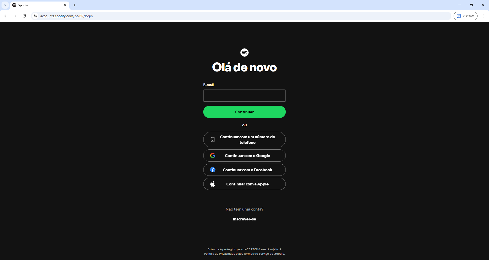
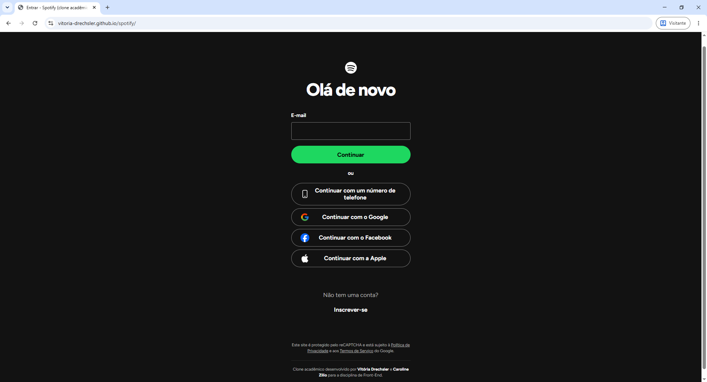

# Clone da Tela de Login do Spotify

Trabalho G1 da disciplina de **Front-End** — Universidade Atitus
Professor: Matheus Henrique Barquette
Construção de página web com HTML e CSS.

## Dupla

| Nome | Matrícula |
|---|---|
| Caroline Russo Zilio | 1140047 |
| Vitória Drechsler | 1139410 |

## Página de referência

Tela de login do Spotify: <https://accounts.spotify.com/pt-BR/login>

Clone publicado: <https://vitoria-drechsler.github.io/spotify/>


O objetivo foi reproduzir visualmente a tela de login do Spotify usando HTML semântico e CSS, construindo tudo a partir da observação da página original, sem copiar o código-fonte dela.

## Estrutura do repositório

```
index.html      -> estrutura da página
style.css       -> todo o estilo (mobile first)
imagens/        -> logo do Spotify e ícones dos botões sociais
prints/         -> prints de comparação usados neste README
README.md       -> este arquivo
```

Para ver a página, basta abrir o `index.html` no navegador.

---

# Comparação com o original

## Desktop

| Original | Clone |
|---|---|
|  |  |

## Celular

| Original | Clone |
|---|---|
|  |  |

---

# Análise da página original

Antes de escrever o código, observamos a página de referência e identificamos cada parte seguindo os itens da seção 1.1 do enunciado.

## Estrutura e tags semânticas

A página tem três partes bem separadas. No topo fica só o logo do Spotify, centralizado, que identifica o site: por isso usamos um `header`. Abaixo vem o conteúdo principal, que é o login em si, e ele foi colocado dentro do `main`. Como todo esse conteúdo trata de um único assunto (entrar na conta) e tem um título próprio ("Olá de novo"), ele ficou em uma `section` ligada ao `h1` pelo `aria-labelledby`.

Os botões "Continuar com um número de telefone", "Google", "Facebook" e "Apple" não enviam dados do formulário: eles levam para outras formas de entrar. Por isso ficaram em uma `nav` com uma lista (`ul` e `li`) e um `aria-label` que explica para leitores de tela que ali estão as outras formas de entrar.

Na parte de baixo fica o aviso do reCAPTCHA com os links de Política de Privacidade e Termos de Serviço, que é informação legal de rodapé, então usamos o `footer`.

Não usamos `article` porque a página não tem nenhum conteúdo independente, que faria sentido sozinho fora dela (como uma notícia ou um post). O login é uma seção da página, não um artigo.

## Imagens

A página tem cinco imagens: o logo do Spotify e os ícones de telefone, Google, Facebook e Apple. Todas receberam `alt` descritivo ("Logo do Spotify", "Ícone do Google" etc.), para que quem usa leitor de tela saiba o que é cada imagem.

## Formulário

O formulário da página original, na versão atual, pede só o e-mail na primeira tela, com o botão "Continuar". A senha é pedida numa tela seguinte. Reproduzimos essa primeira etapa: o campo tem um `label` "E-mail" ligado a ele pelo `for="email"` e `id="email"`, então clicar no texto também seleciona o campo.

---

## Checklist 
## Parte 1: Atividades à serem desenvolvidas no trabalho:

## 1.1 Estrutura HTML semântica e acessível

- [x] **Tags semânticas:** `header` (logo), `main` (conteúdo principal), `section` com `aria-labelledby` apontando para o `h1`, `nav` com `aria-label` para os botões sociais, `form` para o login e `footer` para o aviso legal e os créditos. A justificativa de cada uma está na análise acima.
- [x] **Todas as imagens com `alt` descritivo:** logo e os quatro ícones dos botões sociais.
- [x] **Formulário acessível e funcional:** campo `type="email"` com `label` associado por `for`/`id`, `required` e `autocomplete="username"`. Com `type="email"` e `required`, o próprio navegador valida o campo (vazio ou sem @) sem precisar de JavaScript. Usamos `method="get"` porque o GitHub Pages não aceita envio por POST.

## 1.2 Fidelidade visual à referência

- [x] **Proporções, espaçamentos, cores e tipografia:** as medidas foram tiradas de prints da página original em uma tela de 1366px de largura.

| Elemento | Original | No CSS |
|---|---|---|
| Largura da coluna | 324px | `--largura-formulario` |
| Logo | 32 × 32px | `.topo__logo` |
| Espaço acima do logo (desktop) | 104px | `.topo` na media query |
| Título "Olá de novo" | 48px no desktop, peso 800 | `.cartao__titulo` |
| Campo de e-mail | 48px de altura, borda cinza, cantos de 4px | `input[type="email"]` |
| Botões | 48px de altura, formato de pílula | `--altura-botao`, `--raio-pilula` |
| Espaço entre botões sociais | 8px | `.login-social ul` (gap) |
| Verde do botão | #1ed760 | `--cor-verde` |
| Fundo | #121212 | `--cor-fundo` |
| Texto secundário | #b3b3b3 | `--cor-texto-secundario` |
| Texto do rodapé | 11px | `--texto-legal` |

- [x] **Mesma organização de cabeçalho, conteúdo e rodapé:** logo no topo, título, formulário, "ou", botões sociais, cadastro e aviso do reCAPTCHA no rodapé, na mesma ordem do original.
- [x] **Diferenças justificadas:**
  - **Fonte:** o Spotify usa a SpotifyMix, uma fonte proprietária que não pode ser usada fora dos produtos deles. Usamos a **Figtree**, do Google Fonts, que é gratuita e tem formas e pesos bem parecidos.
  - **A referência mudou durante o trabalho:** quando começamos, a tela de login tinha o título "Entrar no Spotify", campos de e-mail e senha, "Lembrar de mim" e um cartão escuro sobre fundo degradê no desktop. No dia 27/09 a página já estava diferente: título "Olá de novo", login em duas etapas (só o e-mail na primeira tela) e fundo liso. Como o enunciado pede para chegar o mais próximo possível do original, refizemos o cartão no commit 9. Os commits 2 a 8 mostram a versão antiga.
  - **Só a primeira etapa do login:** a tela de senha do original só aparece depois de digitar um e-mail válido e depende de JavaScript e do servidor do Spotify, então reproduzimos apenas a primeira tela, que é a do link de referência.
  - **Ícones:** os ícones dos botões sociais foram salvos como imagens separadas, então o traço e o tamanho podem variar um pouco em relação ao original.
- [x] **Análise da página original:** está na seção [Análise da página original](#análise-da-página-original).

## 1.3 CSS: seletores, box model e variáveis

- [x] **Tipos de seletor usados:**

| Tipo | Exemplo no `style.css` |
|---|---|
| Universal | `*` no reset |
| Elemento | `body`, `img`, `ul`, `a` |
| Classe | `.botao-social`, `.cartao__titulo` |
| Descendente | `.login-social ul`, `.rodape a`, `.rodape p` |
| Filho direto | `.campo > label` |
| Atributo | `input[type="email"]` |
| Pseudo-classe | `:root`, `:hover`, `:focus`, `:focus-visible`, `:active`, `:user-invalid` |
| Pseudo-elemento | `*::before`, `*::after` |
| Agrupamento | `a:focus-visible, button:focus-visible` |

- [x] **Cascata e especificidade:** `.rodape p` define `margin: 0 auto` para todos os parágrafos do rodapé. O parágrafo dos créditos precisa de margem em cima, então usamos `.rodape .rodape__credito` (duas classes), que é mais específico que `.rodape p` (uma classe e um elemento) e por isso vence sem precisar de `!important`.
- [x] **Box model:** o reset usa `box-sizing: border-box`, então largura e altura já incluem padding e borda. A borda dos campos é feita com `box-shadow: inset`, que não ocupa espaço: no foco ela passa de 1px para 3px sem mudar o tamanho do campo. Os botões sociais têm padding maior à esquerda (56px) que à direita (32px) para o texto não encostar no ícone, igual ao original.
- [x] **Variáveis:** todas no `:root`: cores (`--cor-fundo`, `--cor-verde`, `--cor-borda`...), fonte, tamanhos de texto e medidas repetidas (`--altura-botao`, `--raio-pilula`, `--largura-formulario`). O espaçamento usa `--espaco: 8px` como unidade base com `calc()`, por exemplo `calc(var(--espaco) * 4)` para 32px.
- [x] **Unidades:** `rem` nos tamanhos de texto, `px` nas medidas fixas tiradas do original, `em` no `letter-spacing` do título (acompanha o tamanho da fonte), `%` nas larguras e `vh` na altura mínima do `body`.

## 1.4 Responsividade: Flexbox, Grid e mobile first

- [x] **CSS mobile first:** tudo fora da media query é o layout de celular e funciona sozinho.
- [x] **Flexbox:** o `body` é uma coluna flex que empurra o rodapé para baixo; `.topo` e `.conteudo` centralizam o conteúdo; `.cartao`, `.formulario`, `.login-social ul` e `.cadastro` empilham os elementos em coluna com `gap`; `.botao-social` centraliza o texto dentro do botão. Não usamos Grid porque a página é uma coluna única e o Flexbox resolve todo o layout.
- [x] **Media query com `min-width`:** `@media (min-width: 768px)` aumenta o espaço acima do logo para 104px e o título para 48px (3rem). No original, essas são as diferenças entre a tela de celular e a de desktop.
- [x] **Testado no celular e no desktop:** desktop em tela de 1366px e celular pelo modo de dispositivo do DevTools (F12).

## 1.5 Personalização e originalidade

- [x] **Créditos da dupla no rodapé:** um parágrafo que não existe no original, separado do aviso do reCAPTCHA por uma linha (`border-top`), com os nossos nomes destacados em branco.
- [x] O título da aba e a `meta description` também indicam que é um clone acadêmico.

---

## Parte 2: processo no Commits

## Histórico de commits

24/09 | Vitória | Initial commit |
24/09 | Vitória | Add files via upload |
24/09 | Vitória | Criei a estrutura base do projeto com o semântico do HTML e o início do style |
25/09 | Vitória | Adicionei comandos / funções da tela inicial do site |
25/09 | Carol | Adicionadas as imagens, começo do CSS e foi criado o README com o relatório |
25/09 | Carol | Ajuste do layout principal, título e os botões de login |
25/09 | Carol | Ajustes no campo de formulário e botão de mostrar senha |
25/09 | Vitória | Criado o interruptor de lembrar de mim, estilizado o botão Entrar e os links finais |
26/09 | Vitória | Adicionei a seção "clone acadêmico" e estilizei o rodapé |
26/09 | Vitória | Ajustei o layout para telas maiores com media query min-width: 768px |
27/09 | Carol | HTML e CSS: adapta o clone à nova tela "Olá de novo" do Spotify |
27/09 | Carol | README final |
28/09 | Vitória | Commit final: implementação dos prints |

Commits feitos em 4 dias diferentes (24, 25, 26 e 27/09), com `index.html` e `style.css` na raiz do repositório.

---

# Relatório de desenvolvimento

Registro do que foi feito em cada commit e do que a dupla entendeu em cada etapa, escrito ao longo do desenvolvimento.

## Commit 1 — Estrutura base do projeto

Quinta-feira · 24/09 · Vitória

**O que foi feito:** Foi criado um novo repositório no Github, depois criamos os arquivos `index.html` e `style.css`. O `index.html` recebeu o `head` (charset, meta viewport, descrição, título, fonte Figtree e o link para o CSS) e o esqueleto semântico da página: `header` com o logo, `main` ainda vazio e `footer` com o aviso do reCAPTCHA. O `style.css` começou só com o comentário de abertura.

**O que entendemos:**

- Começamos apenas pelo HTML porque ele é como ossos para um site, a base de tudo. Já o CSS, seriam as roupas, acessórios, itens para embelezar...
- Usamos a meta viewport pois ela serve para fazer o site se adaptar corretamente ao tamanho da tela do celular. Sem ela, a página pode ficar toda desproporcional no celular, parecendo que foi feita para uma tela de computador, e aí o usuário precisa ficar dando zoom ou arrastando a tela para conseguir ver tudo.
- O `header` é a parte de cima da página, onde fica a logo do Spotify. O `main` é a parte principal, onde está o formulário de login e as opções para entrar na conta. Já o `footer` é a parte de baixo da página, onde ficam as informações sobre o reCAPTCHA, a Política de Privacidade e os Termos de Serviço.

## Commit 2 — HTML do cartão de login

Sexta-feira · 25/09 · Vitória

**O que foi feito:** Montamos dentro do `main` a `section` do login: o título `h1`, a `nav` com os quatro links de login social em uma lista, o formulário com os campos de usuário e senha (cada um com seu `label`), o botão de mostrar senha com os dois ícones de olho em SVG, o checkbox "Lembrar de mim", o botão Entrar e os links de esqueci a senha e cadastro. Validamos o HTML no validator.w3.org.

**O que entendemos:**

- Colocamos os botões dentro de uma `nav` e não em um `form` porque esses botões são outras formas de entrar na conta, mas não fazem parte do formulário de login com e-mail e senha. Então, o `nav` serve para organizar essas opções de navegação.
- Quando clicamos no texto do `label`, o campo que está ligado a ele também é selecionado. Isso facilita bastante para quem usa celular ou tem alguma dificuldade para clicar diretamente no campo, além de ajudar leitores de tela.
- O `aria-describedby` serve para indicar uma informação relacionada ao campo, nesse caso, a mensagem de erro do campo. Já o `aria-pressed` indica se um botão está ativado ou não. No código, ele é usado no botão de mostrar a senha.

## Commit 3 — Imagens, variáveis, reset e cabeçalho

Sexta-feira · 25/09 · Carol

**O que foi feito:** Adicionamos o logo e os ícones na pasta `imagens`. No CSS, criamos as variáveis no `:root` (cores tiradas da página original, fonte e medidas que se repetem, com 8px como unidade base de espaçamento), o reset com `box-sizing: border-box`, o `body` em flex de coluna, o foco visível para quem navega pelo teclado e o cabeçalho com o logo centralizado. Também tiramos o `role="switch"` do checkbox de lembrar de mim, porque o validador do W3C apontou erro por faltar o atributo `aria-checked`.

**O que entendemos:**

- Quando eu troquei o valor de `--cor-fundo`, a cor de fundo da página inteira mudou. A vantagem de usar variáveis é que fica mais fácil alterar uma cor ou outro valor em vários lugares do código de uma vez, sem precisar ficar procurando e mudando cada lugar separadamente.
- O `border-box` faz com que o tamanho definido para o elemento já inclua o `padding` e a borda. Já o `content-box`, que é o padrão, considera o tamanho apenas do conteúdo, então o padding e a borda aumentam o tamanho final do elemento.
- O `body` está usando `display: flex` e `flex-direction: column`, então os elementos ficam organizados um embaixo do outro, como uma coluna. Como o `body` ocupa no mínimo toda a altura da tela, o conteúdo consegue ocupar o espaço e o rodapé fica na parte de baixo.
- O `:focus` aparece sempre que um elemento recebe foco, enquanto o `:focus-visible` aparece principalmente quando o foco é importante para a navegação, como quando estamos usando o teclado. Isso deixa a página mais acessível sem ficar mostrando o contorno toda hora.

## Commit 4 — Layout principal, título e botões de login

Sexta-feira · 25/09 · Carol

**O que foi feito:** Estilizamos o `main` e o cartão do login como uma coluna centralizada com largura máxima de 324px, o título com peso 800 e letras mais juntas, e os botões sociais: a lista virou uma coluna flex com `gap` de 8px, cada botão ganhou formato de pílula com borda cinza, o ícone ficou preso à esquerda e a borda clareia no `:hover`.

**O que entendemos:**

- Para o ícone ficar à esquerda sem tirar o texto do centro, o botão recebe `position: relative` e o ícone `position: absolute`. O ícone sai do fluxo e se posiciona em relação ao botão, e o texto continua centralizado sozinho.
- O `gap` coloca espaço só entre os itens da lista, sem sobrar margem antes do primeiro ou depois do último, o que seria difícil de controlar com `margin`.
- O `letter-spacing` em `em` acompanha o tamanho da fonte: se o título aumentar, o espaço entre as letras aumenta junto.

## Commit 5 — Campos do formulário e botão de mostrar senha

Sexta-feira · 25/09 · Carol

**O que foi feito:** Estilizamos os campos de usuário e senha, com a borda feita por `box-shadow`, placeholder cinza, borda branca no `:hover` e mais grossa no `:focus`. Criamos o estilo das mensagens de erro, que só aparecem quando têm texto, e posicionamos o botão do olho dentro do campo de senha, trocando o ícone conforme o `aria-pressed`.

**O que entendemos:**

- O `box-shadow` com `inset` desenha a borda por dentro do campo e não ocupa espaço. Assim a borda pode ficar mais grossa no foco sem o campo mudar de tamanho e "pular" na tela.
- O seletor de atributo `input[type="password"]` permite estilizar só um tipo de campo, sem precisar criar uma classe nova.
- A pseudo-classe `:empty` seleciona elementos sem conteúdo. Usamos ela para esconder a mensagem de erro enquanto ela está vazia.

## Commit 6 — Interruptor "Lembrar de mim", botão Entrar e links finais

Sexta-feira · 25/09 · Vitória

**O que foi feito:** Criamos o interruptor verde do "Lembrar de mim" usando o checkbox escondido e os pseudo-elementos `::before` (trilho) e `::after` (bolinha) no `label`. Estilizamos o botão Entrar verde, que cresce um pouco no hover, e os links de "Esqueceu sua senha?" e cadastro.

**O que entendemos:**

- O checkbox continua existindo, só fica invisível, então ainda funciona com teclado e leitor de tela. O visual é todo feito no `label` com `::before` e `::after`, que precisam de `content: ""` para aparecer.
- O combinador `+` seleciona o elemento que vem logo depois. Com `.interruptor:checked + label`, o `label` muda de cor quando o checkbox é marcado.
- O `transform: scale()` aumenta o botão sem empurrar os outros elementos, porque não altera o espaço que ele ocupa na página.

## Commit 7 — Créditos da dupla e rodapé

Sábado · 26/09 · Vitória

**O que foi feito:** Adicionamos no rodapé o parágrafo com os créditos da dupla, que é a nossa personalização, e estilizamos o rodapé com texto de 11px, cor cinza e links que clareiam no hover. Também deixamos preparado no CSS o estilo de uma seção "Sobre este clone" com Grid, que acabou não entrando no HTML e foi removida no commit 9.

**O que entendemos:**

- O rodapé legal do original usa um texto bem menor que o resto da página. Guardamos esse tamanho em uma variável para deixar claro no código que ele é um tamanho especial.
- A personalização precisa aparecer na página, mas sem atrapalhar a fidelidade ao original. Por isso ela ficou discreta, no rodapé.

## Commit 8 — Media query para telas maiores

Sábado · 26/09 · Vitória

**O que foi feito:** Criamos a media query `min-width: 768px` com o layout de desktop da versão antiga da página: fundo em degradê, faixa preta com o logo à esquerda, cartão largo e título maior.

**O que entendemos:**

- Como o CSS é mobile first, o celular é o padrão e a media query com `min-width` só acrescenta o que muda a partir de 768px. Se fosse ao contrário, com `max-width`, teríamos que desfazer o layout de desktop para o celular.
- Uma media query só sobrescreve as propriedades que declaramos nela. Todo o resto continua vindo das regras de fora.

## Commit 9 — Adaptação à nova tela "Olá de novo"

Domingo · 27/09 · Carol

**O que foi feito:** A página de referência mudou para o login em duas etapas, então refizemos o cartão para ficar igual ao original atual. No HTML: título "Olá de novo", formulário só com o campo de e-mail e o botão "Continuar", separador "ou", botões sociais na nova ordem (telefone, Google, Facebook e Apple) e "Não tem uma conta?" com "Inscrever-se" em linhas separadas. Removemos a senha, o botão do olho, o "Lembrar de mim", o "Esqueceu sua senha?" e os divisores. No CSS: fundo liso também no desktop, medidas ajustadas aos prints do original, campo `type="email"`, novo estilo do rodapé com os créditos e a media query reduzida ao que muda no desktop (espaço acima do logo e tamanho do título). Removemos os estilos que não tinham mais HTML.

**O que entendemos:**

- Com `type="email"` e `required`, o navegador já não deixa enviar o formulário vazio ou com um e-mail sem @, sem precisar de JavaScript. Por isso tiramos o `novalidate`.
- O `:invalid` marcaria o campo como errado assim que a página abre, porque ele começa vazio. O `:user-invalid` só marca o erro depois que a pessoa mexeu no campo.
- Quando o layout quebrou no meio das alterações, parte do CSS parou de funcionar de uma vez. Uma chave `}` faltando ou sobrando faz o navegador ler as regras seguintes do jeito errado, então vale conferir as chaves sempre que um bloco inteiro deixa de funcionar.
- Especificidade na prática: `.rodape .rodape__credito` vence `.rodape p` porque duas classes pesam mais que uma classe e um elemento.

## Commit 10 — README final

Domingo · 27/09 · Carol

**O que foi feito:** Completamos o README com a análise da página original, o checklist da Parte 1 com as explicações de cada item e o histórico de commits.

**O que entendemos:**

- O README registra o processo, não só o resultado. Ele explica por que o código está do jeito que está, inclusive a mudança de referência no meio do trabalho.

## Commit 11 — Commit final: implementação dos prints 

Segunda-feira · 28/09 · Vitória

**O que foi feito:** Adicionados os prints comparando o clone com o original no desktop e no celular.
